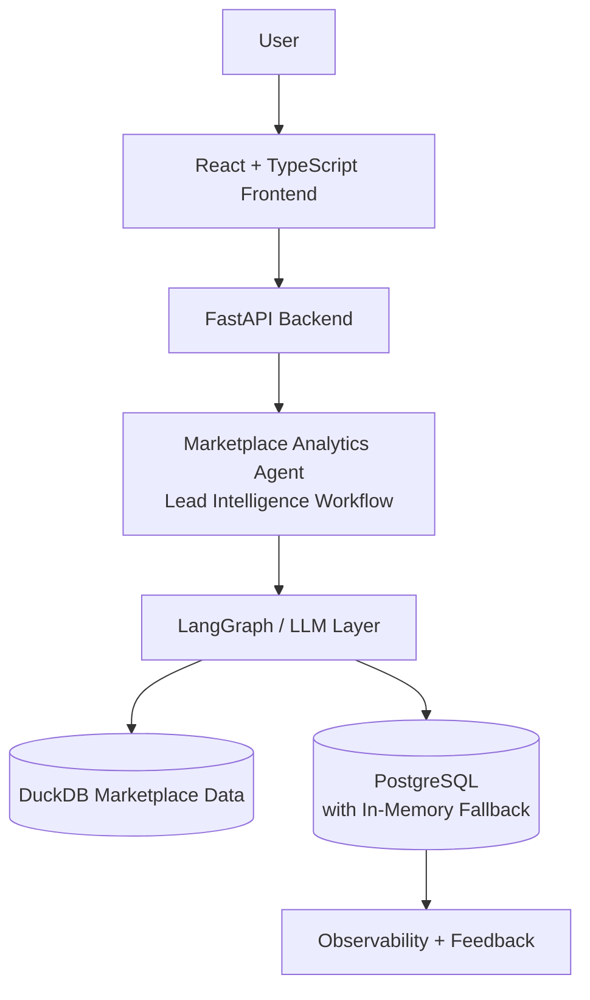
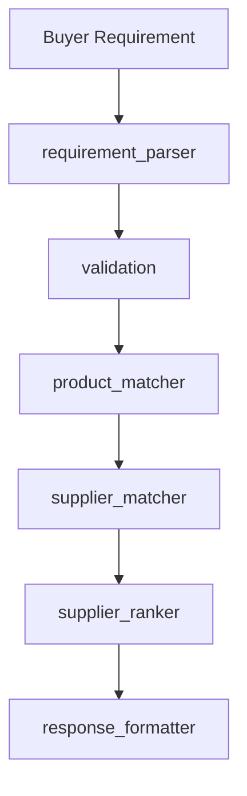

# MarketMind AI

**An Agentic B2B Marketplace Intelligence Platform for marketplace analytics, buyer requirement analysis, product and supplier matching, explainable recommendations, and workflow observability.**

[](https://www.python.org/)
[](https://fastapi.tiangolo.com/)
[](https://react.dev/)
[](https://langchain-ai.github.io/langgraph/)

---

## Why MarketMind AI?

B2B marketplace operations typically span products, suppliers, buyers, leads, and orders. Buyer requirements often arrive as unstructured text. Identifying relevant products and suppliers can take multiple manual steps, while business teams still need analytics *and* actionable recommendations.

MarketMind AI connects those pieces:

- Natural-language analytics over a multi-table marketplace dataset
- A dedicated Lead Intelligence workflow that extracts requirements, matches products/suppliers, and ranks recommendations transparently
- Built-in observability and feedback so agent behavior is inspectable

---

## Core Features

### Marketplace Analytics

Natural language → LangGraph workflow → SQL/Python analysis → visualization → business insights

- One-click **Load Marketplace Demo** (DuckDB tables: categories, suppliers, buyers, products, leads, orders)
- Cross-table joins for GMV, conversion, regional demand, supplier performance
- Charts, tables, and narrative reports

### Lead Intelligence

Buyer requirement → requirement extraction → validation → product matching → supplier matching → **deterministic ranking** → recommendation

Statuses include: `complete`, `needs_info`, `no_products`, `no_suppliers`, `failed`

### Agent Observability

- Workflow runs with `run_id`, status, and latency
- Node-level execution for the Lead Intelligence graph
- Success / failure metrics
- Helpful / Not Helpful user feedback (optional comments)

### Resilience

- PostgreSQL persistence when available
- In-memory fallbacks for sessions / observability
- LangGraph MemorySaver when Postgres is unavailable
- DEMO MODE for Lead extraction without API credentials

---

## Architecture



### Lead Intelligence node workflow



Analytics and Lead Intelligence are **separate** LangGraph graphs.

---

## Technology Stack

| Layer | Stack |
| :--- | :--- |
| Frontend | React, TypeScript, Vite, Tailwind CSS |
| Backend | Python, FastAPI, Uvicorn, Pydantic |
| Agents | LangGraph, LangChain |
| LLMs | Groq (Llama 3.3 70B), optional Google Gemini fallback |
| Analytics store | DuckDB (in-memory, per session) |
| App state / observability | PostgreSQL 16 (with in-memory fallback) |
| Charts / reports | Plotly, ReportLab |
| Infra | Docker Compose (Postgres) |
| Tests | pytest |

---

## Dataset Notice

**The marketplace dataset is synthetic and created for demonstration purposes. It does not contain real customer, supplier, or proprietary marketplace data.**

| Table | Approx. rows | Role |
| :--- | ---: | :--- |
| categories | 20 | Parent + leaf categories |
| suppliers | 80 | Ratings, verification, response time |
| buyers | 160 | Companies by industry / state |
| products | 430+ | Linked to suppliers & categories |
| leads | 800 | Enquiries with status & estimated value |
| orders | 550 | Buyer ↔ supplier transactions |

---

## Supplier Ranking

Supplier ranking is **deterministic and explainable**. The LLM does **not** arbitrarily decide supplier ranking.

Exact implemented formula (`backend/marketplace/lead/ranking.py`):

```text
final_score =
  0.35 × product_match_score      # best product text/category match in [0,1]
+ 0.20 × rating_score             # supplier.rating / 5.0
+ 0.15 × verified_score           # 1.0 if verified else 0.0
+ 0.15 × response_time_score      # faster → higher (1 - hours/72)
+ 0.10 × order_performance_score  # delivered/confirmed share + volume
+ 0.05 × location_score           # same city=1.0, same state=0.6, else 0.0
```

Each recommendation includes a short human-readable explanation of score components.

---

## Demo Mode vs Real LLM Mode

### Real LLM Mode

Requires a valid configured LLM API key:

```bash
GROQ_API_KEY=gsk_your_real_key
DEMO_MODE=auto
```

- Lead Intelligence uses Groq for requirement extraction (`extraction_source: "llm"`)
- Analytics planner / SQL generation uses the live LLM
- Optional `GOOGLE_API_KEY` enables Gemini fallback

### DEMO Mode

When valid credentials are unavailable, the requirement extraction stage can use a deterministic demo extractor.

```bash
GROQ_API_KEY=your_groq_api_key
DEMO_MODE=auto
```

**The deterministic demo extractor is not an LLM and exists to allow the complete workflow to be demonstrated without external API credentials.**

- Labeled `extraction_source: "demo_deterministic"`
- Validation → matching → ranking → observability still run for real
- Marketplace analytics sample questions use DuckDB SQL fallbacks when the LLM key is invalid
- Unclear input such as `asdf` still returns `needs_info`

---

## Quick Start

### Prerequisites

- Python 3.10+
- Node.js 18+
- Docker Desktop (optional; recommended for PostgreSQL)
- Optional Groq API key for Real LLM Mode: [console.groq.com](https://console.groq.com)

### One command

```bash
./start.sh
```

Open **http://127.0.0.1:5173**

`./start.sh` ensures `.env` exists, starts Postgres when Docker is available, installs deps if needed, and launches backend (`:8000`) + frontend (`:5173`).

If Docker Desktop is not running on macOS, open it manually, wait until healthy, then re-run `./start.sh`. Marketplace demo + Lead Intelligence DEMO Mode still work without Postgres.

### Manual alternative

```bash
docker compose up -d
python3 -m venv .venv && source .venv/bin/activate
pip install -r requirements.txt
cp -n .env.example .env
uvicorn backend.main:app --reload --host 127.0.0.1 --port 8000

# new terminal
cd frontend && npm install && npm run dev
```

---

## Testing

```bash
# from repository root (with venv activated or using .venv/bin/python)
python -m pytest
```

Focused MarketMind suite:

```bash
python -m pytest backend/tests/test_marketplace_lead.py -v
```

Tests cover supplier ranking, demo extractor, product matching, Lead workflow statuses, and API smoke checks. They run in DEMO MODE and do not require a live LLM API key.

---

## Demo Flow

1. Open the application (`http://127.0.0.1:5173`).
2. Click **Load Marketplace Demo**.
3. Run: `Which product categories generated the highest order value?`
4. Open **Lead Intelligence**.
5. Run: `Need 500 solar panels in Jaipur within two weeks`
6. Show: extracted requirement, product matches, supplier recommendations, deterministic ranking, node execution, latency.
7. Submit **Helpful** feedback.
8. Open **Agent Monitoring**.
9. Run: `Need xyz unknown widget` — show `no_products` behavior.

---

## Example Queries

**Workspace analytics**

- Which product categories generated the highest order value?
- Which states generate the most buyer enquiries?
- What is the lead conversion rate by category?
- Which suppliers have the fastest response times?

**Lead Intelligence**

- Need 500 solar panels in Jaipur within two weeks
- Looking for industrial water pumps for my factory in Delhi
- Need bulk packaging boxes in Mumbai
- Need xyz unknown widget → `no_products`
- asdf → `needs_info`

---

## API Endpoints

| Method | Path | Purpose |
| :--- | :--- | :--- |
| `POST` | `/marketplace/demo` | Load marketplace demo |
| `POST` | `/analyze` | Conversational analytics |
| `POST` | `/marketplace/lead/analyze` | Lead Intelligence |
| `POST` | `/marketplace/feedback` | Helpful / not helpful |
| `GET` | `/marketplace/observability/runs` | Recent runs |
| `GET` | `/marketplace/observability/summary` | Metrics summary |
| `POST` | `/upload` | Upload a single CSV |
| `GET` | `/execution/{session_id}/trace` | Analytics trace |
| `GET` | `/history/{session_id}` | Session history |
| `GET` | `/metrics` | Legacy analytics metrics |

---

## Screenshots

Place real UI captures in `docs/images/` (for example: analytics, lead intelligence, ranking, agent monitoring). Do not use stock or fabricated images.

Legacy files under `screenshots/` may reflect earlier UI iterations; prefer fresh captures from the running MarketMind UI.

---

## Project structure

```text
.
├── backend/
│   ├── agents/           # Marketplace analytics LangGraph
│   ├── marketplace/      # Demo data, Lead Intelligence, observability
│   ├── database/         # Postgres pool + schema
│   ├── tests/            # pytest suite
│   └── main.py
├── data/marketplace/     # Synthetic seed CSVs
├── docs/images/          # UI screenshots (optional)
├── frontend/             # React + TypeScript
├── docker-compose.yml
├── start.sh
├── pytest.ini
├── requirements.txt
└── README.md
```

---

## License

MIT
