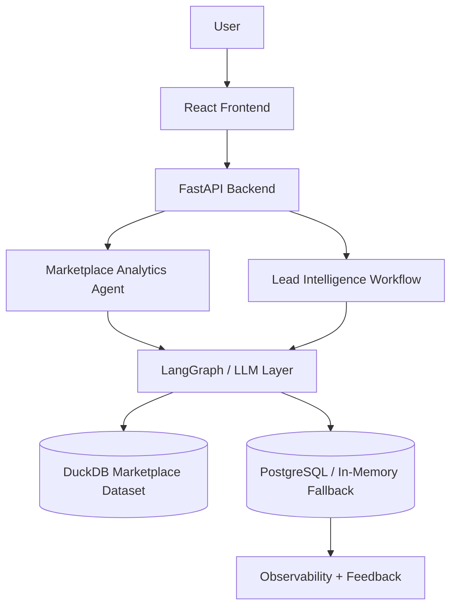
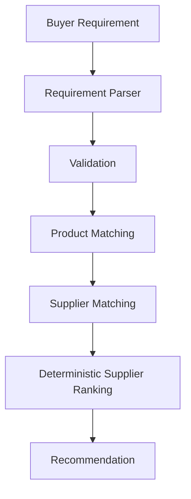

# MarketMind AI

**MarketMind AI is an Agentic B2B Marketplace Intelligence Platform** for analyzing marketplace data, understanding buyer requirements, matching products and suppliers, and generating explainable business recommendations.

It combines natural-language analytics over a multi-table marketplace dataset with a dedicated Lead Intelligence LangGraph workflow, deterministic supplier ranking, and built-in observability.

---

## Overview

MarketMind AI helps marketplace operators and sales teams:

- Ask business questions across buyers, suppliers, products, categories, leads, and orders
- Turn unstructured buyer requirements into ranked, explainable supplier shortlists
- Observe agent runs, latency, and user feedback in one place

The platform ships with a synthetic Indian B2B marketplace demo so you can run a full recruiter-style walkthrough locally—even without a live LLM API key.

---

## Problem Statement

B2B marketplaces accumulate large volumes of operational data while buyer demand often arrives as free-text enquiries. Teams struggle to:

- Answer cross-table questions quickly (GMV, conversion, supplier performance, regional demand)
- Extract structured product, quantity, and location signals from unstructured requirements
- Match buyers to relevant products and suppliers with transparent scoring
- Monitor agent workflows and collect feedback for continuous improvement

MarketMind AI addresses this with a multi-agent analytics engine plus a separate Lead Intelligence workflow on top of a realistic synthetic marketplace dataset.

---

## Key Features

- **AI-powered marketplace analytics** — natural-language questions over DuckDB marketplace tables
- **LangGraph workflow orchestration** — supervisor + specialized workers for analytics; separate graph for leads
- **Lead Intelligence** — requirement parsing → validation → product match → supplier match → ranking
- **Explainable deterministic supplier ranking** — formula-based scores, never invented by an LLM
- **Marketplace demo dataset** — one-click load of six related tables
- **Observability** — run IDs, node timings, latency, success metrics
- **User feedback** — Helpful / Not Helpful with optional comments
- **Fallback resilience** — PostgreSQL or in-memory persistence; MemorySaver when Postgres is unavailable
- **LLM + Demo extraction** — Supports LLM-based requirement extraction when configured, with a **deterministic demo extractor** for local demonstrations when API credentials are unavailable (demo extraction is **not** an LLM)

---

## System Architecture



### Lead Intelligence workflow



Analytics and Lead Intelligence are **separate** LangGraph graphs. Lead Intelligence does not modify the analytics agent topology.

---

## Technology Stack

| Layer | Stack |
| :--- | :--- |
| Frontend | React, TypeScript, Vite, Tailwind CSS |
| Backend | Python, FastAPI, Uvicorn, Pydantic |
| Agents | LangGraph, LangChain |
| LLMs | Groq (Llama 3.3 70B), optional Google Gemini fallback |
| Analytics store | DuckDB (in-memory, per session) |
| App state / observability | PostgreSQL 16 (with in-memory fallback) |
| Charts / reports | Plotly, ReportLab |
| Infra | Docker Compose (Postgres) |

---

## Marketplace Dataset

Synthetic seed CSVs in `data/marketplace/` (no real personal data):

| Table | Approx. rows | Role |
| :--- | ---: | :--- |
| categories | 20 | Parent + leaf categories |
| suppliers | 80 | Ratings, verification, response time |
| buyers | 160 | Companies by industry / state |
| products | 430+ | Linked to suppliers & categories |
| leads | 800 | Enquiries with status & estimated value |
| orders | 550 | Buyer ↔ supplier transactions |

Domains include solar, packaging, industrial equipment, agriculture, and related Indian B2B categories.

---

## Supplier Ranking Logic

Ranking is **fully deterministic**. The LLM is never used to invent scores.

```text
final_score =
  0.35 × product_match_score      # best product text/category match in [0,1]
+ 0.20 × rating_score             # supplier.rating / 5.0
+ 0.15 × verified_score           # 1.0 if verified else 0.0
+ 0.15 × response_time_score      # faster response → higher (1 - hours/72)
+ 0.10 × order_performance_score  # delivered/confirmed share + volume
+ 0.05 × location_score           # same city=1.0, same state=0.6, else 0.0
```

Each recommendation includes a short human-readable explanation of the score components.

---

## Observability and Feedback

| Store | Contents |
| :--- | :--- |
| `workflow_runs` | run id, status, latency, match counts, errors |
| `workflow_node_runs` | node name, order, duration, status |
| `workflow_feedback` | helpful / not_helpful + optional comment |

Tracked Lead nodes: `requirement_parser` → `validation` → `product_matcher` → `supplier_matcher` → `supplier_ranker` → `response_formatter`.

**Dashboard metrics**

- `success_rate` = complete / (total − running)
- `average_latency_ms` = mean finished latency
- `helpful_feedback_rate` = helpful / all feedback

UI: **Lead Intelligence** (node timings + feedback) · **Agent Monitoring** (summary + recent runs)

---

## API Endpoints

| Method | Path | Purpose |
| :--- | :--- | :--- |
| `POST` | `/upload` | Upload a single CSV |
| `POST` | `/marketplace/demo` | Load full marketplace demo |
| `POST` | `/analyze` | Conversational marketplace analytics |
| `POST` | `/marketplace/lead/analyze` | Lead Intelligence workflow |
| `POST` | `/marketplace/feedback` | Helpful / not helpful feedback |
| `GET` | `/marketplace/observability/runs` | Recent workflow runs |
| `GET` | `/marketplace/observability/summary` | Success rate, latency, feedback rate |
| `GET` | `/execution/{session_id}/trace` | Analytics pipeline trace |
| `GET` | `/history/{session_id}` | Session report history |
| `GET` | `/report/{execution_id}/pdf` | Download PDF report |
| `GET` | `/metrics` | Legacy analytics execution metrics |

---

## Demo Mode vs Real LLM Mode

### Real LLM Mode

Requires a valid configured API key:

```bash
GROQ_API_KEY=gsk_your_real_key
DEMO_MODE=auto
```

- Lead Intelligence uses Groq for requirement extraction (`extraction_source: "llm"`)
- Analytics planner / SQL generation uses the live LLM
- Optional `GOOGLE_API_KEY` enables Gemini fallback

### DEMO Mode

Works without a real API key (placeholders are fine):

```bash
GROQ_API_KEY=your_groq_api_key
DEMO_MODE=auto
```

- Lead requirement extraction uses a **deterministic demo extractor** (keyword / regex rules)
- Responses are labeled `extraction_source: "demo_deterministic"`
- **Demo Mode does not claim that an LLM processed the requirement**
- Validation, product/supplier matching, deterministic ranking, and observability still run for real
- Marketplace analytics sample questions use DuckDB SQL fallbacks when the LLM key is invalid
- Unclear input such as `asdf` still returns `needs_info`

| Variable | Required | Purpose |
| :--- | :--- | :--- |
| `DATABASE_URL` | Recommended | Postgres connection string |
| `GROQ_API_KEY` | For Real LLM Mode | Primary LLM |
| `GOOGLE_API_KEY` | Optional | Gemini fallback |
| `DEMO_MODE` | Optional (`auto`) | `auto` / `true` / `false` |
| `GEMINI_FALLBACK_MODEL` | Optional | Default `gemini-2.5-flash` |
| `SANDBOX_TIMEOUT_SECONDS` | Optional | Default `10` |
| `SANDBOX_MEMORY_LIMIT_MB` | Optional | Default `256` |

> If Postgres is down, the API still starts: marketplace demo, Lead Intelligence, MemorySaver analytics checkpointer, and in-memory observability remain available.

---

## Quick Start

### Prerequisites

- Python 3.10+
- Node.js 18+
- Docker Desktop (optional but recommended for PostgreSQL)
- Optional: Groq API key from [console.groq.com](https://console.groq.com) for Real LLM Mode

### One command

```bash
./start.sh
```

Then open **http://127.0.0.1:5173**

`./start.sh` will:

1. Ensure `.env` exists (from `.env.example`) with `DEMO_MODE=auto`
2. Start PostgreSQL via Docker Compose when Docker is running
3. Install Python / Node dependencies if needed
4. Start backend (`:8000`) and frontend (`:5173`)

If Docker Desktop is not running on macOS, open it manually, wait until it is healthy, then re-run `./start.sh`. Marketplace demo + Lead Intelligence DEMO Mode still work without Postgres.

### Manual alternative

```bash
docker compose up -d

python3 -m venv .venv
source .venv/bin/activate
pip install -r requirements.txt
cp -n .env.example .env

uvicorn backend.main:app --reload --host 127.0.0.1 --port 8000

# new terminal
cd frontend && npm install && npm run dev
```

---

## Demo Flow

Recruiter-friendly walkthrough:

1. Open the app → click **Load Marketplace Demo**
2. In **Workspace**, ask: `Which product categories generated the highest order value?`
3. Open **Lead Intelligence**
4. Analyze: `Need 500 solar panels in Jaipur within two weeks`
5. Review product matches and explainable supplier ranking
6. Submit **Helpful** / **Not Helpful** feedback
7. Open **Agent Monitoring** to inspect runs, latency, and feedback metrics

---

## Example Queries

**Workspace analytics**

- Which product categories generated the highest order value?
- Which states generate the most buyer enquiries?
- What is the lead conversion rate by category?
- Which suppliers have the fastest response times?
- Show monthly marketplace GMV trends.

**Lead Intelligence**

- Need 500 solar panels in Jaipur within two weeks
- Looking for industrial water pumps for my factory in Delhi
- Need bulk packaging boxes in Mumbai
- Need agricultural equipment for bulk purchase
- Need xyz unknown widget *(expects `no_products`)*
- asdf *(expects `needs_info`)*

---

## Project structure

```text
.
├── backend/
│   ├── agents/              # Analytics LangGraph multi-agent system
│   ├── marketplace/         # Demo data + Lead Intelligence + observability
│   ├── database/            # Postgres pool + schema init
│   └── main.py              # FastAPI entrypoint
├── data/marketplace/        # Seed CSVs
├── frontend/                # React app
├── docker-compose.yml
├── start.sh
├── requirements.txt
├── .env.example
└── README.md
```

---

## License

MIT
